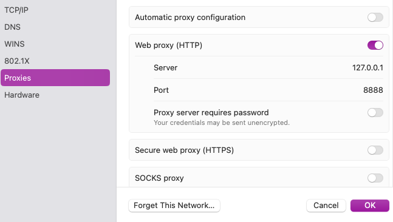
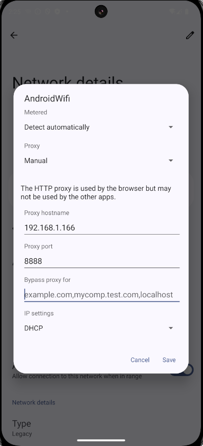

# Mobile App to Local Kubernetes Cluster Connectivity

In the example deployment you add the following URLs to your computer's hosts file:

```text
login.democluster.example
api.democluster.example
```

Whether an Android emulator can resolve these URLs depends on your computer's operating system:

| Host Operating System | Emulator Hostname Resolution Works? |
| --------------------- | ----------------------------------- |
| Linux | Yes |
| Windows | No |
| macOS | No |

The following steps enable connectivity and SSL trust for the local computer's Kubernetes domains.

## Run an HTTP Proxy

To enable connectivity for a Windows or macOS host you can run an HTTP proxy tool.\
This forces hostname resolution to take place on the host computer.

Choose an HTTP proxy tool such as [mitmproxy](https://docs.mitmproxy.org/stable/overview-installation/) and install it.\
Then follow the instructions to activate the HTTP proxy temporarily on your computer.



Find your network connection using a command like this, and get the IP address, eg 192.168.1.166:

```bash
ifconfig | grep "inet " 
```

Then activate the proxy against your emulator's Wifi network connection:



Some emulators may require you to use the special IP address of `10.0.2.2` instead of your computer's IP address.

## Configure SSL Trust

On Linux, first locate the root certificate that the emulator needs to trust:

```text
resources/apigateway/external-certs/democluster.ca.pem
```

Then convert it to the .DER format that Android requires:

```bash
openssl x509 -in democluster.ca.pem -out democluster.ca.der -outform DER
```

On Windows or macOS, perform the equivalent operation for your HTTP proxy's root certificate.\
For example, mitmproxy provides a CA certificate at a location like this:

```bash
~/.mitmproxy/mitmproxy-ca-cert.pem
```

On the emulator, navigate to a location like this, drag in the certificate and install it:

```text
Settings / Security & privacy / Encryption & credentials / Install a certificate / CA certificate
```

## Run the App

The app should now securely connect from the emulator to the Kubernetes cluster on the host computer.\
You can then run its OAuth operations and debug the code if required.
