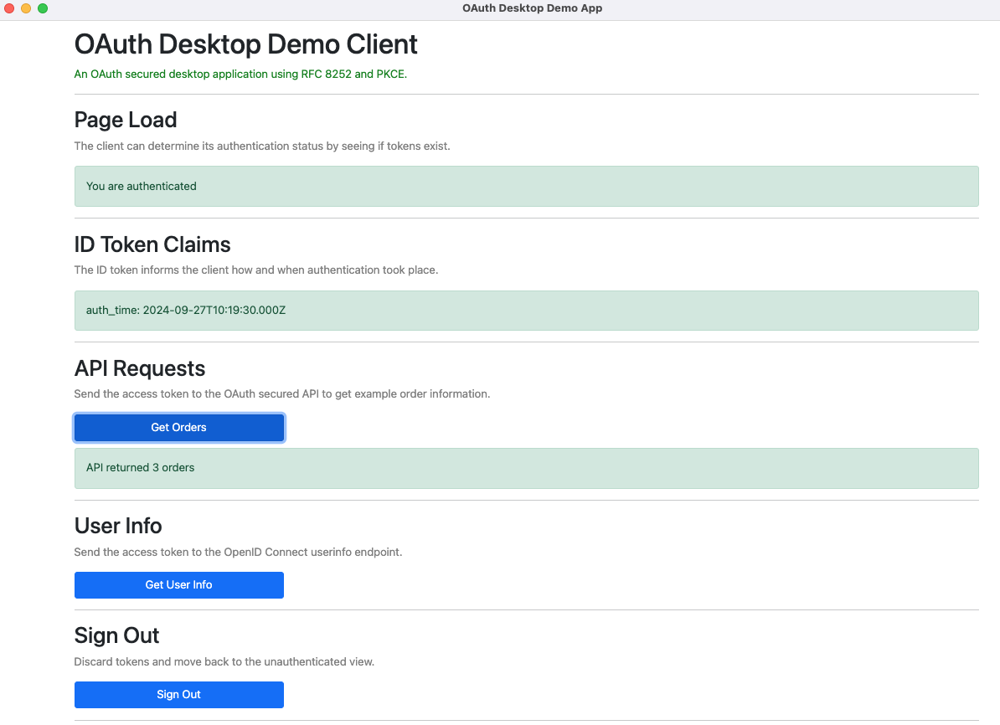

# Desktop App Code Example

A desktop app that runs a code flow to authenticate users and get an access token with which to call APIs.

## Prerequisites

First run [deployment scripts](../README.md) to run backend components in a local Kubernetes cluster.\
Install Node.js 20 or later, then trust the authorization server and API certificates:

```bash
export NODE_EXTRA_CA_CERTS='../../resources/apigateway/external-certs/democluster.ca.pem'
```

Also configure your browser to trust the same root certificate if you want to avoid warnings.\
For example, on macOS use Keychain Access to add it to the system keystore.

## Run the App

Then use the following commands to run the app:

```bash
npm install
npm start
```

Sign in as one of the test user accounts:

- User: `dana`, Password: `Password1` (high privilege user)
- User: `kim`, Password: `Password1` (low privilege user)

The desktop app receives its login response using a local HTTP server.\
After user authentication the app shows how to run API requests, token refresh and basic logout:



## Electron Code

See the [Electron Notes](ELECTRON-NOTES.md) for details on the development platform the desktop app uses.

## Configuration

The app uses the following configuration settings:

```typescript
export class Configuration {
    public static readonly clientId = 'demo-desktop-client';
    public static readonly scope = 'openid profile retail/orders'
    public static readonly authorizationServerBaseUrl = 'https://login.democluster.example/oauth/v2/oauth-anonymous';
    public static readonly idTokenAlgorithm = 'ES256';
    public static readonly apiBaseUrl = 'https://api.democluster.example/orders';
}
```

## Source Code Overview

The following table summarizes the application's main source files:

| Source File | Description |
| ----------- | ----------- |
| [main.ts](src/main.ts) | The entry point to the main process |
| [renderer.tsx](src/renderer.tsx) | The entry point to the renderer process |
| [app.tsx](src/renderer/app.tsx) | The entry point to React views in the renderer process |
| [preload.js](src/preload.js) | An interface that extends the window object in the renderer process |
| [ipcRequest.ts](src/renderer/ipcRequest.ts) | The renderer process uses this to call the main process |
| [ipcRequestHandler.ts](src/main/ipcRequestHandler.ts) | The main process uses this to handle renderer requests |
| [oauthClient.ts](src/main/oauth/oauthClient.ts) | The main process uses this to make OAuth requests |
| [loginRequestResponse.ts](src/main/oauth/loginRequestResponse.ts) | The main process uses this to send the login request and gets back the login response |
| [apiClient.ts](src/main/apiClient.ts) | The main process uses this to make API requests |
